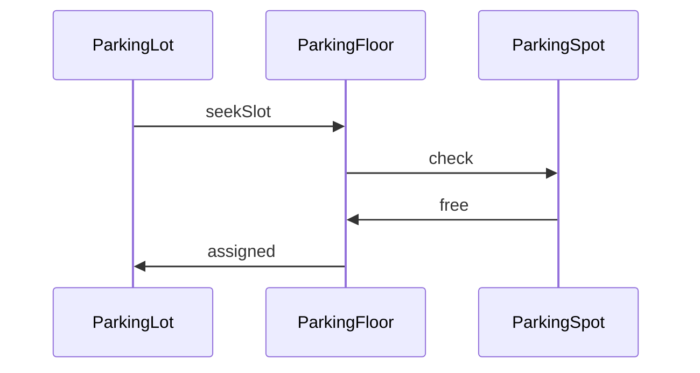
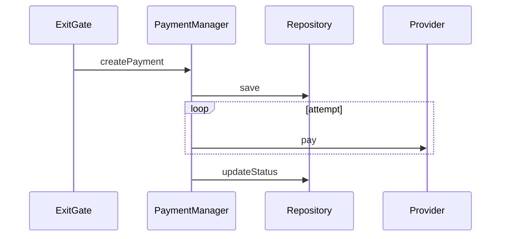

# Parking Management System (Low Level Design)

This repository contains the Low Level Design of a Parking Management System.  
The design focuses on modeling real-world parking behavior such as vehicle entry, slot allocation, ticketing, exit flow, and slot release.

The goal of this design is to demonstrate:
- clear object responsibility
- real-world entity modeling
- practical flow design
- extensibility through clean interfaces
- correctness over visual design

---

## Scope of the Design

What is modeled in this design:

- Vehicles with size classification
- Slot allocation based on vehicle size
- Multiple parking floors
- Ticket generation at entry
- Ticket validation at exit
- Fee calculation during exit
- Slot release after exit
- Real-time availability updates
- Payment lifecycle representation

What is intentionally not implemented:

- UI layer
- Networking layer (HTTP / APIs)
- Authentication / authorization
- Distributed system concerns
- Deployment and infra
- External integrations

This design focuses purely on system behavior and object interaction.

---

## High-Level Structure

The system is organized into logical layers:

```

Entry / Exit Gates
↓
Parking Services
↓
Domain Models
↓
Repositories
↓
Database

```

Each layer has one responsibility and communicates only with the layer below it.

---

## Core Domain Objects

### Vehicle

Represents a physical vehicle entering the parking system.

```

Vehicle

* size
* licenseNumber

```

---

### VehicleSize (Enumeration)

Defines the supported classification of vehicles.

```

VehicleSize

* SMALL
* MEDIUM
* LARGE

```

---

### ParkingSpot

Represents one parking unit.

Responsibilities:
- Track occupancy
- Check compatibility with vehicle size
- Assign and release vehicles

```

ParkingSpot

* id
* supportedSize
* isOccupied

```

---

### Ticket

Generated when the vehicle enters.

Responsibilities:
- Track parking start time
- Maintain mapping with vehicle and slot

```

Ticket

* id
* entryTime
* vehicle
* parkingSpot

```

---

### ParkingFloor

Represents a collection of parking spots.

Responsibilities:
- Maintain list of spots
- Find available spot based on vehicle size

```

ParkingFloor

* id
* spots[]

```

---

### ParkingLot

Acts as the lifecycle controller.

Responsibilities:
- Manage all parking floors
- Handle delegation for allocation and release
- Maintain pricing strategy

```

ParkingLot

* floors
* pricingPolicy

```

---

### Payment

Represents a payment attempt.

Responsibilities:
- Persist amount
- Capture status
- Maintain retry attempt count

```

Payment

* id
* ticket
* amount
* status
* attempts

````

---

## Functional Flow

---

### 1. Vehicle Entry

1. Vehicle arrives at entry gate.
2. System looks for an available parking spot based on vehicle size.
3. Parking floor retrieves the matching spot.
4. Spot is assigned.
5. Ticket is created.
6. Display board is updated.

---

### Entry Sequence Diagram

```mermaid
sequenceDiagram
Vehicle ->> EntryGate: arrives
EntryGate ->> ParkingLot: requestSpot(size)
ParkingLot ->> ParkingFloor: findAvailable
ParkingFloor ->> ParkingSpot: assign
ParkingSpot ->> TicketService: create
TicketService ->> EntryGate: ticket
EntryGate ->> DisplayBoard: update
````

---

### 2. Vehicle Exit

1. Vehicle reaches exit gate.
2. Ticket is validated.
3. Fee is calculated.
4. Payment is processed.
5. Parking spot is released.
6. Display is updated.

---

### Exit Sequence Diagram

```mermaid
sequenceDiagram
Vehicle ->> ExitGate: submit ticket
ExitGate ->> TicketService: validate
TicketService ->> PricingService: calculate
PricingService ->> ExitGate: amount
ExitGate ->> PaymentService: pay
PaymentService ->> ParkingSpot: release
ParkingSpot ->> DisplayBoard: refresh
ExitGate ->> Vehicle: exit
```

---

### 3. Slot Allocation



---

### 4. Payment Flow



---

## Database Model

The database structure supports persistence of system state.

---

### vehicle

| Column         | Description    |
| -------------- | -------------- |
| id             | identifier     |
| license_number | vehicle number |
| size           | vehicle size   |

---

### parking_floor

| Column       | Description      |
| ------------ | ---------------- |
| id           | floor identifier |
| floor_number | index            |

---

### parking_spot

| Column         | Description     |
| -------------- | --------------- |
| id             | spot identifier |
| floor_id       | parent floor    |
| supported_size | compatible size |
| occupied       | state           |

---

### ticket

| Column     | Description        |
| ---------- | ------------------ |
| id         | ticket id          |
| vehicle_id | associated vehicle |
| spot_id    | allocated spot     |
| entry_time | timestamp          |

---

### payment

| Column    | Description    |
| --------- | -------------- |
| id        | payment id     |
| ticket_id | reference      |
| amount    | charged amount |
| attempts  | retry count    |
| status    | state          |

---

## Design Decisions

* Allocation responsibility is owned by ParkingFloor, not ParkingLot.
* Gate objects do not access database directly.
* Payment logic is isolated from exit handling.
* Slot release must happen only after successful payment.
* Display is updated through notification, not direct writes.
* Entities reflect real-world nouns, not technical abstractions.

---


## Purpose of This Design

This project is intended for:

* Low-level design practice
* Interview preparation
* Reasoning about real-world systems
* Understanding flow separation
* Improving modelling clarity

---

Design Patterns
Pattern	Purpose
Factory	Vehicle creation
Strategy	Pricing
Strategy	Payment
Singleton	ParkingLot
Observer	Display updates

## Project Status

This repository contains design only.
No runtime implementation is provided.

---

