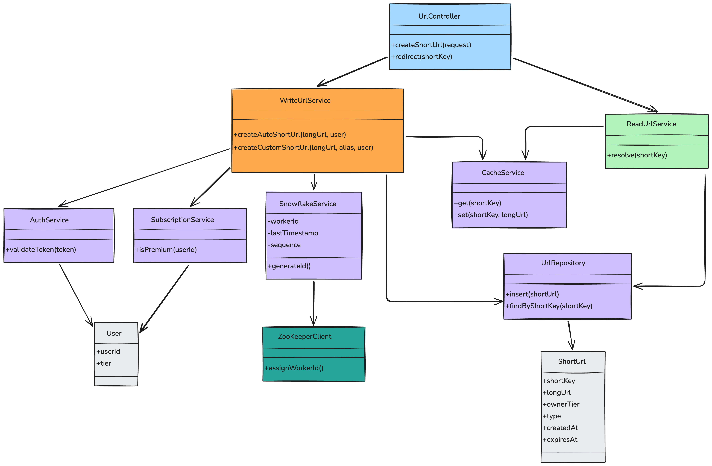

# 🔗 Production-Ready URL Shortener


Design -> https://lnkd.in/gphACfug
Sequence diaagram -> https://lnkd.in/gKRDpR5Y
 

A scalable, distributed URL Shortener designed with production-level architecture principles including Read/Write separation, distributed ID generation (Snowflake), caching, and clean service layering.

---

# 📌 Table of Contents

1. Overview
2. System Architecture
3. Design Principles
4. High-Level Architecture
5. Component Breakdown
6. Data Model
7. URL Creation Flow
8. Redirect Flow
9. Distributed ID Generation (Snowflake)
10. Scaling Strategy
11. Caching Strategy
12. Database Design
13. Custom Alias & Premium Flow
14. Failure Handling
15. Production Considerations
16. Future Improvements
17. How to Run (Sample Setup)

---

# 1️⃣ Overview

This project demonstrates how to design a production-ready URL shortener similar to Bitly or TinyURL.

Key goals:

* Horizontally scalable
* Low latency redirects
* Clean service separation
* Distributed-safe ID generation
* Extensible for premium features

---

# 2️⃣ System Architecture

The system is divided into logical layers:

* Controller Layer
* Write Service Layer
* Read Service Layer
* Shared Services
* Infrastructure Services

The system separates high-traffic reads from lower-traffic writes.

---

# 3️⃣ Design Principles

* Single Responsibility Principle
* Separation of Concerns
* Horizontal Scalability
* Cache-First Reads
* Database Write Consistency
* Infrastructure Decoupling
* Extensible for Future Features

---

# 4️⃣ High-Level Architecture

Client
↓
Load Balancer
↓
-

| WriteUrlService (xN) |
| ReadUrlService (xN)  |
------------------------

```
    ↓         ↓
 Redis       DB
            Primary + Replicas
```

---

# 5️⃣ Component Breakdown

## UrlController

Handles incoming HTTP requests.

Methods:

* createShortUrl(request)
* redirect(shortKey)

---

## WriteUrlService

Responsible for URL creation.

Responsibilities:

* Authenticate user
* Validate subscription
* Generate short key
* Persist data
* Update cache

Methods:

* createAutoShortUrl()
* createCustomShortUrl()

---

## ReadUrlService

Responsible for resolving short URLs.

Responsibilities:

* Check cache
* Fallback to DB replica
* Update cache

Method:

* resolve(shortKey)

---

## SnowflakeService

Generates distributed unique IDs.

Fields:

* workerId
* lastTimestamp
* sequence

Method:

* generateId()

---

## AuthService

Validates authentication tokens.

Method:

* validateToken(token)

---

## SubscriptionService

Checks user premium status.

Method:

* isPremium(userId)

---

## UrlRepository

Handles database interactions.

Methods:

* insert(shortUrl)
* findByShortKey(shortKey)

---

## CacheService

Wraps Redis interaction.

Methods:

* get(shortKey)
* set(shortKey, longUrl)

---

# 6️⃣ Data Model

## ShortUrl

Fields:

* shortKey
* longUrl
* ownerTier
* type
* createdAt
* expiresAt

---

## User

Fields:

* userId
* tier

---

# 7️⃣ URL Creation Flow

1. Client sends request
2. Controller forwards to WriteUrlService
3. Token validated via AuthService
4. If custom alias → check SubscriptionService
5. If auto-generated → SnowflakeService generates ID
6. Base62 encoding applied
7. URL stored in Primary DB
8. Cache updated
9. Response returned

---

# 8️⃣ Redirect Flow

1. Client requests short URL
2. Controller calls ReadUrlService
3. Cache lookup performed
4. If hit → redirect
5. If miss → query DB replica
6. Cache updated
7. HTTP 302 redirect returned

---

# 9️⃣ Distributed ID Generation (Snowflake)

Snowflake generates unique 64-bit IDs using:

* Timestamp
* Worker ID
* Sequence number

Benefits:

* No database round-trip
* Horizontally scalable
* Unique across instances

Worker ID assigned via ZooKeeper or service registry.

---

# 🔟 Scaling Strategy

## Horizontal Scaling

* Multiple WriteUrlService instances
* Multiple ReadUrlService instances

## Database Scaling

* Primary for writes
* Replicas for reads

## Cache Scaling

* Redis cluster
* TTL-based eviction

---

# 1️⃣1️⃣ Caching Strategy

Cache-Aside Pattern:

Read:

* Check cache
* If miss → DB → update cache

Write:

* Write to DB
* Update cache

Benefits:

* Reduces DB load
* Low latency redirects

---

# 1️⃣2️⃣ Database Design

Table: short_urls

Columns:

* short_key (PRIMARY KEY)
* long_url
* owner_tier
* type
* created_at
* expires_at

Index:

* short_key (unique index)

---

# 1️⃣3️⃣ Custom Alias & Premium Flow

Custom aliases require premium subscription.

Flow:

1. Validate user
2. Check subscription
3. Verify alias availability
4. Insert into DB
5. Cache update

Premium logic separated from payment logic.

---
